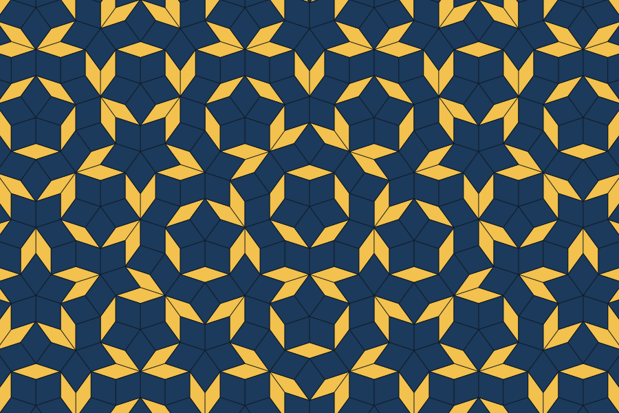

# Penrose tilings

An interactive visualiser for Penrose and other aperiodic tilings. Pick a tiling
from the list, choose two colours and a border colour, set the canvas size and
tile size, and the tiling fills the background as an SVG you can download as SVG
or PNG.

Everything is generated in the browser: the tilings are computed in TypeScript
(compiled by Vite) and emitted as SVG paths — there is no server, no canvas
rasterisation for display, and no runtime dependencies.



## Tilings

| Tiling | Prototiles | How it is generated |
| --- | --- | --- |
| Penrose P3 — rhombs | thick + thin rhomb | Robinson triangle deflation, half-tiles glued on their bases |
| Penrose P2 — kite and dart | kite + dart | Robinson triangle deflation with the mirror axis tracked per half-tile |
| Penrose P1 — pentagons | 3 matched pentagons + star + boat + diamond | six-prototile pentagonal L-system decomposition |
| Penrose rhombs — pentagrid | thick + thin rhomb | de Bruijn's pentagrid (dual of five line families, offsets summing to zero) |
| Robinson triangles | golden triangle + gnomon | the P3 deflation, drawn as half-tiles |
| Ammann–Beenker (8-fold) | square + 45° rhomb | four-family multigrid |
| Dodecagonal (12-fold) | 30°/60°/90° rhombs | six-family multigrid |
| Heptagonal (14-fold) | three rhombs | seven-family multigrid |
| Decagonal (20-fold) | five rhombs | ten-family multigrid |
| Socolar (12-fold) | 30° rhomb + square + hexagon | six-family dual grid, with 60° rhomb triples recomposed as hexagons |
| Tübingen triangle | four handed Robinson triangles | golden-ratio substitution retaining left/right hierarchy state |
| Hat monotile (einstein) | one 13-sided tile | H/T/P/F metatile substitution (see credits) |
| Pinwheel (Conway–Radin) | 1–2–√5 right triangle | rep-5 substitution; tiles appear in infinitely many orientations |
| Chair (L-tromino) | L-tromino | rep-4 substitution, grown outwards from a central supertile |
| Sphinx hexiamond | pentagonal hexiamond + mirror image | exact rep-4 affine dissection |
| Voderberg spiral | congruent interlocking nonagons | plane-covering double spiral grown recursively in successive beak-to-butt layers |
| Shuriken supertile (12-fold) | dodecagon + 1–2–150° triangle + triangle + three rhombs | the n = 12 dissection of the inflated dodecagon (rim triangles, central dodecagon, 96-rhomb shuriken star), laid out on the 4.6.12 Archimedean tiling |
| Squiral | one rep-9 spiral tile, in two chiralities | Baake and Grimm's scale-3 bijective 3×3 block substitution, run on the rosettes of four like-handed tiles and drawn with the spiral carrier |
| Jeandel–Rao 11 Wang tiles | eleven unit squares with four edge colours | coding the orbit of a point under the two unit translations of the torus ℝ²/⟨(φ,0),(1,φ+3)⟩ through Labbé's eleven-letter Markov partition; each square drawn as four triangles carrying its edge colours |

Tilings with more than two tile classes (including P1, the Tübingen handed
states, and the hat's five metatile classes) shade their classes evenly between
the two chosen colours.

## Controls

* **Type** — the tiling, grouped by family and sorted by name within each group.
* **Colour 1 / Colour 2** — the two tile colours, as pickers or hex values, plus
  ten named preset palettes grouped into classic and studio collections.
* **Border** — colour, width, and a *transparent* switch that drops the stroke
  entirely (the background is then filled with a blend of the two colours so no
  seams show).
* **Screen size** — fit the window, one of the common presets (Full HD, 4K,
  phone, A4, square) or a custom pixel size.
* **Tile size** — the nominal tile size in pixels. Tile areas are normalised per
  tiling, so 40 px means roughly the same visual density everywhere. A patch is
  capped at 30 000 tiles; past that the tile size is raised automatically and the
  status line says so, which keeps a 4K canvas from locking up the tab.

The full configuration lives in the URL hash, so any view can be shared or
bookmarked.

## Exports

* **Download SVG** — the standalone SVG at the chosen pixel size.
* **Download PNG** — the same image rasterised at the chosen pixel size.

Files are named after their settings, for example
`penrose-p3_1920x1080_tile42_e8b53b-1b3a5c_border-101820.svg`.

## Development

```bash
npm ci
npm run dev        # Vite dev server
npm run typecheck  # tsc --noEmit
npm test           # vitest
npm run build      # typecheck + production build into dist/
```

Static PNG assets are generated from their SVG sources. After changing the
favicon or preview, regenerate them with:

```bash
./scripts/generate-assets.sh
```

The test suite samples random points inside every generated patch and asserts
that each is covered by exactly one tile, which catches both gaps and overlaps —
the failure mode that a wrong substitution rule produces. To eyeball the output:

```bash
PREVIEW_DIR=/tmp/tilings npm test   # writes one SVG per tiling
```

## Deployment

`Dockerfile` is a multi-stage build: Node 24 typechecks, tests and builds the
site, then a `scratch` stage places the contents of `dist` at the image root.
The resulting data-only OCI image is mounted read-only as a Kubernetes image
volume and served by the shared frontend nginx. It is not a runnable container.
Images carry OpenContainers annotations and are published to
`oci.wadas.dev/nuc/penrose-tilings`.

```bash
docker build -t penrose-tilings .
```

Gitea Actions:

* `.gitea/workflows/ci.yaml` — typecheck, test and build on every push and pull
  request, uploading `dist` as an artifact.
* `.gitea/workflows/image.yaml` — build and push the container image on `main`,
  tagged `YYYY.DDD.HHMM`, the branch name and `latest`.

## Credits

The hat metatile construction is ported from Craig S. Kaplan's
[hatviz](https://github.com/isohedral/hatviz) (BSD 3-Clause) — see
[THIRD-PARTY-LICENSES.md](THIRD-PARTY-LICENSES.md). The P1 L-system follows the
rules documented by Andrew Stacey's [Penrose package](https://ctan.org/pkg/penrose).
The Sphinx rep-4 child maps follow the classical four-copy hexiamond
dissection. Everything else is derived from the geometry described on Wikipedia's
[Penrose tiling](https://en.wikipedia.org/wiki/Penrose_tiling) and
[list of aperiodic sets of tiles](https://en.wikipedia.org/wiki/List_of_aperiodic_sets_of_tiles)
pages.
