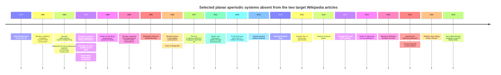

# Planar aperiodic tilings absent from the current Wikipedia “Penrose tiling” and “Aperiodic tiling” articles

## Executive summary

A literally exhaustive list of “all known” planar aperiodic tilings does **not** exist as a finite mathematical object. There are general constructions producing infinitely many substitution tilings and infinitely many finite local-rule tile sets; Goodman-Strauss proved that, under mild hypotheses, planar substitution hierarchies can be enforced by local rules, immediately yielding infinite collections of aperiodic sets. He has also exhibited large finite families of distinct aperiodic tile sets from a common construction. citeturn15search31turn15search17 Consequently, the most defensible interpretation of the request is a catalog of **named, independently published tilings and named construction families** in the Euclidean plane, rather than an attempt to enumerate every substitution rule anybody has ever written down.

I checked the current versions of the two requested Wikipedia articles and excluded the systems they explicitly discuss or name. That removes, at minimum, Berger's sets, Robinson's tiles, the standard Penrose families and Robinson triangles, Ammann's chair/A2 where it is used as the chair example, the trilobite-and-cross system, pinwheel, Kari's 14 Wang tiles, Socolar–Taylor, the hat and its 2023–24 monotile context, and related Penrose systems explicitly named on the Penrose page such as Tübingen triangles, hexagon–boat–star, tie-and-navette, Mikulla–Roth and the binary/Godrèche–Lançon family. citeturn1view0turn1view1turn2view1turn2view3turn2view6 I have also conservatively omitted straightforward Wang encodings of an excluded tiling when their only significance is that encoding.

Under that interpretation, the literature supports roughly four major clusters not described on those pages:

* the less-famous Ammann systems and classical octagonal/dodecagonal quasiperiodic tilings;
* later polygonal substitution families, including non-Pisot and dense-orientation examples;
* the modern small-Wang-tile line from Culik through Jeandel–Rao, Labbé and the 2025–26 metallic/quadratic families;
* exceptional systems whose diffraction is not Bragg-like, notably the **squiral** and **Frank–Robinson** tilings, plus unusual monotiles such as the Mampusti–Whittaker dendrite tile. citeturn17search0turn18search2turn20search0turn21search22

Several of these are mathematically important precisely because they broaden what “aperiodic order” can mean. The Ammann–Beenker, Shield/Socolar and other regular-model-set examples have sharp pure-point diffraction; squiral and Frank–Robinson instead have essentially singular-continuous diffraction; dense-orientation substitutions have statistically circular diffraction and essentially no nontrivial Bragg component; Kari–Culik has **positive entropy** and no substitution hierarchy. citeturn13search12turn17search0turn18search5turn17search18turn21search4turn21search24

A useful general fact behind several entries below is that a primitive finite-local-complexity substitution fixed point has uniform patch frequencies and a uniquely ergodic tiling dynamical system. This justifies the “yes” entries for unique ergodicity where the cited construction is primitive and FLC. citeturn13search0 Likewise, regular model sets are pure-point diffractive. citeturn13search12 For local forcing, “decorated/collared” means that finite matching rules follow from the general Goodman-Strauss forcing theorem, not necessarily that the author's original unmarked shapes themselves form an aperiodic prototile set. citeturn15search31

## Scope and exclusions

I use **aperiodic tiling** in the dynamical/local-rule sense broad enough to include a named nonperiodic substitution hull even when the bare geometric shapes, stripped of markings, could also tile periodically. This is necessary because otherwise famous examples such as many substitution tilings disappear merely by erasing labels. Conversely, purely periodic rep-tiles, arbitrary quasiperiodic point sets with no established tiling realization, random tiling ensembles, isolated nonperiodic tilings with no canonical hull or rule, and unpublished gallery submissions are not counted as primary catalog entries.

“First publication” means the earliest identifiable public mathematical source for the named construction. Where discovery preceded publication, I state both. Ammann is the main example: several systems were discovered around 1977 but only systematically published in *Tilings and Patterns* in 1987 and in the 1992 Ammann–Grünbaum–Shephard paper. citeturn14search0turn14search2turn21search19 For Jeandel–Rao and several recent systems, I similarly distinguish an arXiv/preprint announcement from refereed publication.

I treat **different prototile presentations that are merely aliases as one entry**, but keep mutually locally derivable systems separate when they genuinely use different tile sets—for example Ammann A4 versus A5/Ammann–Beenker, and Shield versus Socolar. MLD systems have essentially the same tiling dynamics but are not literally the same prototiles.

The following table uses:

**PP** = pure-point diffraction; **SC** = singular-continuous diffraction; **MLD** = mutually locally derivable; **FLC** = finite local complexity. “UE” means unique ergodicity of the indicated natural hull. For dense-orientation tilings, repetitivity/FLC statements are with respect to **rigid motions**, not translations alone.

## Deduplicated literature catalog

| Tiling / aliases | First publication / authors | Prototiles and matching rules | Substitution / self-similar | Hierarchical | Forced by finite local rules? | Repetitive / uniquely ergodic | Diffraction / quasicrystal status | Key results and representative sources |
|---|---|---|---|---|---|---|---|---|
| **Ammann A1** | Ammann, discovered c. 1977; formal literature Grünbaum–Shephard 1987; Ammann–Grünbaum–Shephard 1992 | Six keyed/marked polygonal tiles. Local edge geometry forces successively larger binary-tree structures rather than a periodic lattice. | Not normally presented as a conventional primitive tile substitution. | **Yes**, nested binary-tree hierarchy. | **Yes**, native geometric/marked rules. | The full space has exceptional corridors/fault structures; not a single minimal/UE substitution hull. | No standard diffraction classification comparable with A5 is established in the classical sources. | One of Ammann's least-known original systems; its aperiodicity is proved by enforced composition. citeturn14search3turn21search19 |
| **Ammann A3** | Ammann, discovered 1977; published Grünbaum–Shephard 1987 | Three marked polygonal prototiles; Ammann-type line/edge constraints. | **Yes**, self-similar; inflation factor is the golden ratio. | **Yes.** | **Yes**, original matching rules; also forceable by substitution machinery. | Primitive/FLC substitution ⇒ repetitive and UE for its canonical hull. | Not a conventional cut-and-project tiling; a clean rigorous diffraction classification is much less prominent than for A5. | A useful counterexample to the assumption that all classical Ammann substitutions are projection tilings. citeturn14search2turn14search5turn13search0 |
| **Ammann A4** | Ammann, discovered 1977; published 1987 | Two nonconvex/decorated prototiles; an alternative local presentation of octagonal order. | **Yes**, silver-mean self-similar substitution. | **Yes.** | **Yes.** | Repetitive and UE in canonical primitive hull. | MLD with Ammann–Beenker/A5; consequently shares its pure-discrete dynamical/model-set order. | Important because a very different two-tile geometry encodes the same octagonal local-isomorphism class as A5. citeturn14search0turn14search22turn13search0 |
| **Ammann–Beenker tiling / octagonal tiling / Ammann A5** | **1982**, F. P. M. Beenker independently; Ammann version published 1987 | Standard presentation uses a square and 45° rhombus with arrow/Ammann-bar matching information. | **Yes**, inflation \(1+\sqrt2\). | **Yes.** | **Yes**, decorated edge/vertex rules. | Repetitive; UE. | **Regular cyclotomic model set; PP diffraction with eightfold Fourier symmetry.** | One of the canonical mathematical quasicrystals; has substitution, matching-rule and 4D cut-and-project descriptions. citeturn14search6turn14search12turn13search12 |
| **Penrose \(1+\epsilon+\epsilon^2\) tiling / Penrose hexagon–triangle tiling / Penrose hexagonal tiling** | **1997**, Roger Penrose | Three prototiles up to Euclidean motion in the polygonal presentation; marked hexagon/triangle-derived pieces, with mirror images and local arrow/line information enforcing nested structures. | An inflation/hierarchical construction exists, though it is structurally quite different from P2/P3. | **Yes.** | **Yes**, marked local rules. | The canonical hierarchical components are recurrent; a complete modern ergodic treatment is less standard than for Penrose P2/P3. | More naturally related to hexagonal/limit-periodic hierarchical order than to the golden-ratio Penrose model set; detailed diffraction depends on the realization. | Published as “Details of a \((1+\epsilon+\epsilon^2)\)-aperiodic set”; later compared with other hierarchical hexagonal monotile systems. citeturn16search0turn16search1turn16search9 |
| **Pegasus tiles** | Public version by Goodman-Strauss by 2003; archival paper **2016**, Chaim Goodman-Strauss; first drawn 1996 | **Two** polygonal tiles using unusually economical “tip-to-tip” matching rules. Closely related in construction to Penrose's 1997 hexagonal system. | Hierarchical construction; not usually catalogued as a standard primitive stone substitution. | **Yes**, hierarchy is central to the aperiodicity proof. | **Yes**, native tip-to-tip rules. | Detailed minimality/UE results are not a major part of the published account. | No dedicated rigorous diffraction theory located. | A particularly small non-Penrose aperiodic pair and a good example of non-edge-color matching constraints. citeturn15search1 |
| **Golden-triangle tiling / Danzer–van Ophuysen right-golden-triangle tilings** | **2001**, Ludwig Danzer & Gerard van Ophuysen; related dual construction by Gelbrich 1997 | Similar right golden triangles of two sizes. The forcing presentation uses colored/oriented variants—ten tile types in the standard finite rule; vertex “crowns” act as the local constraints. | **Yes**, substitution. | **Yes.** | Undecorated triangles: **no**; colored version: **yes**. | Canonical substitution family is recurrent; primitive components are UE. | Closely tied to the chair/A2 by duality, but a separate diffraction classification is not prominent. | Danzer–van Ophuysen proved the substitution family is **sofic**, i.e. obtainable from finite decorated local rules. citeturn15search2turn15search14turn15search22 |
| **Shield tiling / Gähler shield / Niizeki–Gähler dodecagonal tiling** | Geometric dodecagonal construction **1987**, Niizeki & Mitani; Shield formulation **1988**, Franz Gähler | Underlying shapes are square, equilateral triangle and “shield”, with marking/orientation splitting them into four standard prototiles. Arrow/line matching creates prescribed vertex crosses. | **Yes**, self-similar versions. | **Yes.** | **Yes**, perfect matching rules. | Repetitive and UE for regular/generic model-set hull. | **12-fold regular model set; PP diffraction.** Acceptance window is a regular dodecagon. | One of the cleanest dodecagonal cut-and-project quasicrystal models; MLD with Socolar's dodecagonal tiling. citeturn22search1turn22search7turn22search10turn22search16 |
| **Socolar dodecagonal tiling / Socolar 12-fold tiling** | **1989**, Joshua E. S. Socolar | Three principal decorated prototile types with line/Ammann-bar-style constraints. | **Yes**, explicit deflation. | **Yes.** | **Yes**, direct matching rules. | Repetitive/UE in canonical hull. | Projection construction equivalent to the deflation construction; dodecagonal quasicrystalline PP order. MLD with Shield. | Socolar explicitly demonstrated both sufficiency of the matching rules and equivalence of deflation and projection constructions. citeturn22search0turn22search3turn22search23 |
| **Stampfli tiling / deterministic dodecagonal square–triangle tiling** | **1986**, Peter Stampfli | Squares and equilateral triangles, with orientation/state information in deterministic inflation versions; often counted as five decorated prototiles. | **Yes**, dodecagonal inflation; full-step factor \(2+\sqrt3\) is standard. | **Yes.** | A deterministic decorated inflation can be locally constrained; the **bare square–triangle ensemble is not itself uniquely forced** and also has random variants. | Primitive deterministic hull: repetitive/UE; random square–triangle ensembles are a different object. | Canonical dodecagonal quasicrystal; higher-dimensional descriptions use nontrivial/fractal atomic surfaces. | Historically central to 12-fold quasicrystal modelling and the subsequent large square–triangle literature. citeturn22search2turn22search20turn22search11 |
| **Watanabe–Ito–Soma eightfold tiling** | Proceedings version **1986**, Y. Watanabe, M. Ito, T. Soma & T. Betsumiya; journal **1987**, Watanabe, Ito & Soma | Squares and rhombi obtained by a self-similar subdivision of octagonal unit cells. | **Yes.** | **Yes.** | No comparably canonical perfect edge-matching rule was established in the short original paper. | Canonical substitution realization is recurrent; explicit UE proof is not a focus of the original source. | Constructed specifically as an eightfold nonperiodic/quasiperiodic tessellation. | An independent octagonal inflation distinct in presentation from Ammann–Beenker. citeturn21search3turn21search7 |
| **Watanabe–Soma–Ito twelvefold tiling** | **1995**, Y. Watanabe, T. Soma & M. Ito | Three base shapes: **thin rhombus, equilateral triangle and square**. | **Yes**, self-similar inflation/deflation, factor \(2+\sqrt3\). | **Yes.** | No widely used perfect matching-rule tileset identified in the original publication; the substitution itself determines the canonical tilings. | FLC under rigid motions; canonical primitive component has the usual substitution recurrence properties. | Explicitly developed as a dodecagonal quasiperiodic tiling. | The inflation matrix is derived from a regular 12-fold zonogon. citeturn20search4turn21search27 |
| **Danzer sevenfold tiling / Danzer triangles; part of the Nischke–Danzer \(n\)-fold family** | **1996**, Klaus-Peter Nischke & Ludwig Danzer | Flagship 7-fold example uses three triangle shapes, with four edge lengths involving \(\sin(k\pi/7)\). Vertex stars provide a finite local rule after orientation states are distinguished. | **Yes.** | **Yes.** | **Yes in principle** via allowed vertex stars; the encyclopedia notes that the full explicit list was never separately published. | Primitive substitution ⇒ recurrent/UE when the corresponding FLC component is used. | Inflation factor is **non-Pisot**. For a scalar primitive FLC substitution this precludes the rich nontrivial eigenvalue structure of Pisot/model-set quasicrystals; a complete SC diffraction formula is not known. | Nischke–Danzer developed a broader method for \(n\)-fold inflation rules, so this row represents an actual published family rather than one isolated design. citeturn19search0turn15search6turn13search0 |
| **Schaad–Stampfli \(1+\sqrt3\) dodecagonal tiling** | **2021**, Theo P. Schaad & Peter Stampfli | Square, 30° rhombus and equilateral triangles split into half-triangles; three half-triangle substitution variants can be recombined in nine ways. | **Yes**, inflation \(1+\sqrt3\). | **Yes.** | No complete perfect matching-rule theorem is part of the publication. | Recurrent for the chosen inflation construction; a full hull classification remains comparatively undeveloped. | Designed as a quasiperiodic tiling with repeated 12-fold rosettes and arbitrarily large globally 12-fold-symmetric patches. | Extends the deterministic Stampfli tradition with a different inflation factor and tile decomposition. citeturn20search13turn22academia29 |
| **Cyclotomic aperiodic substitution tilings / CAST family** | **2017**, Stefan Pautze | Cyclotomic polygon/rhomb/triangle substitution constructions parametrized by rotational order; individual members have finite sets of oriented prototiles. | **Yes**, by definition. | **Yes.** | No single universal native matching rule; decorated local forcing follows for suitable recognizable/FLC members. | Primitive members are repetitive/UE. | Intended to systematize noncrystallographic rotational symmetries; diffraction varies with the member and is not uniformly classified. | A family-level entry is essential: the paper covers a wide range of planar aperiodic cyclotomic substitutions, so counting each drawing as an independent “tiling” would be artificial. citeturn21search30turn15search31 |
| **Fivefold Shuriken tiling** | **2017**, Dirk Frettlöh, April L. D. Say-awen & Maria Louise Antonette N. de las Peñas; preprint 2016 | Twelve polygonal prototile states in the catalogued rule. Substitution deliberately introduces an angle incommensurate with \(\pi\), producing dense orientations. | **Yes**, primitive self-similar; inflation \(\sqrt{6+\sqrt5}\). | **Yes.** | Not chiefly designed as a small native matching-rule set; decorated/collared forcing is available for appropriate substitution formulation. | Repetitive/UE with respect to rigid-motion hull; orientations become uniformly distributed. | **Statistically circular diffraction**; dense orientations force the nontrivial pure-point component to disappear, so this is unlike a conventional Bragg quasicrystal. | A major post-pinwheel construction showing prescribed noncrystallographic symmetry together with dense tile orientations. citeturn19search5turn17search18 |
| **Twelvefold Shuriken tiling** | **2017**, same paper; catalogued construction associated with Skezeer John B. Paz | Fourteen prototile states; dodecagonal version of the dense-orientation construction. | **Yes**, inflation \(\sqrt{5+2\sqrt3}\). | **Yes.** | Decorated/collared substitution forcing; no famous minimal native edge-rule set. | Repetitive/UE in rigid-motion formulation. | As above, statistical rotational symmetry gives circular rather than discrete 12-fold Bragg diffraction. | Demonstrates that “12-fold symmetric” need not mean a conventional rank-4 dodecagonal model set. citeturn19search7turn17search18 |
| **General dense-tile-orientation \(n\)-fold substitution family** | **2017**, Frettlöh, Say-awen & de las Peñas | Primitive polygonal substitutions constructed to contain irrational relative tile rotations. | **Yes.** | **Yes.** | Forceable after suitable labels/collaring; not one universal prototile set. | Primitive systems have strong recurrence; orientation distributions are uniform under the hypotheses proved in this line of work. | Circularly symmetric diffraction; essentially incompatible with a nontrivial discrete rotational Bragg module. | The paper proves constructions invariant under \(n\)-fold rotation for \(n=2,3,4,5,6,8\), beyond the two named Shuriken showcase examples. citeturn22academia27turn17search18 |
| **Squiral tiling** | Baake & Grimm, **2012** preprint; journal publication **2014** | Geometrically a square-based “squiral” inflation; algebraically MLD with a two-symbol bijective \(3\times3\) block substitution. | **Yes**, primitive, scale 3. | **Yes.** | Finite decorated/collared local rules exist for the substitution hierarchy. | Repetitive and UE. | **Balanced version: purely SC diffraction.** Dynamical spectrum is mixed, containing pure-point and SC parts. | One of the canonical rigorous demonstrations that a deterministic, highly ordered two-dimensional substitution can have no Bragg diffraction beyond the trivial part under balanced weighting. citeturn17search0turn17academia30turn13search0 |
| **Inductive Rotation tiling / Hofstetter–Frettlöh tiling** | **2014** preprint, Dirk Frettlöh & Kurt Hofstetter | A fourfold polygonal/decorated construction generated by an “inductive rotation” scheme; the substitution encodes successively rotated supertiles. | **Yes.** | **Yes.** | The aperiodicity belongs to the specified substitution/decorated hull rather than the bare polygon shape alone. | Natural substitution hull is recurrent; the paper studies the hull explicitly. | **Limit-periodic and PP diffractive.** | Especially instructive because aperiodicity, substitution self-similarity, limit-periodicity and pure-point diffraction coexist. citeturn17academia29 |
| **Frank–Robinson tiling** | Frank & Robinson, late 2000s; standard source: N. P. Frank & E. A. Robinson Jr., **2008** | Four rectangular/square-type prototiles in a “stone inflation”; scale \(\lambda=(1+\sqrt{13})/2\). Irrational relative geometric offsets generate infinite local complexity. | **Yes**, primitive self-similar. | **Yes.** | Not known as a simple finite native matching-rule tileset; its ILC prevents direct application of the usual FLC forcing story. | Natural rubber-topology hull is well defined and recurrent; standard FLC statements need modification. | **Only the trivial Bragg peak at 0 plus SC diffraction; no absolutely continuous part.** | A paradigmatic planar **non-Pisot, infinite-local-complexity** inflation and a sharp contrast to model-set quasicrystals. citeturn18search2turn18search5 |
| **Tribonacci Rauzy-fractal plane tiling / aperiodic Rauzy fractal tiling** | Origin in Gérard Rauzy's **1982** substitution/fractal work; later explicit tiling formulations | Fractal prototiles associated with the Tribonacci substitution \(1\mapsto12,\;2\mapsto13,\;3\mapsto1\); equivalent polygonal/topological substitutions can encode the same combinatorics. | **Yes**, self-similar. | **Yes.** | A topological substitution can reproduce the fractal tiling; “matching rules on simple polygons” are not the usual formulation. | Primitive substitution gives minimal/UE dynamics in the standard formulation. | Pisot/Rauzy systems belong to the pure-discrete/model-set side of substitution dynamics under the standard regularity hypotheses. | Bédaride, Hilion & Jolivet proved a strong equivalence between a topological substitution tiling and the Tribonacci fractal tiling. Rauzy's original paper is **in French**. citeturn17search23turn17search26 |
| **Culik's 13 Wang tiles / Kari–Culik 13-tile set** | **1996**, Karel Culik II | Thirteen unit Wang squares over five edge colors; adjacent colors must agree. Arithmetic/transducer constraints encode multiplication between successive symbolic rows. | **No.** | **No conventional substitution hierarchy.** | **Yes**, Wang edge-color rules themselves are local. | Full Wang shift is not a primitive minimal substitution system; it contains nontrivial minimal subsystems. | No canonical physical quasicrystal diffraction. The shift has **positive topological entropy**. | Culik reduced the then record from Kari's 14 tiles to 13. Later work shows positive entropy and explains why the system is not self-similar/hierarchically decomposable. citeturn6search0turn21search0turn21search4turn21search24 |
| **Jeandel–Rao 11 Wang tiles** | **2015**, Emmanuel Jeandel & Michaël Rao preprint/discovery; refereed **2021** | Eleven unit Wang tiles with four edge colors. | The **whole shift is not simply one substitution**, but its measure-theoretically dominant/minimal component has a deep substitutive structure. | Minimal core: **yes**, through a sequence of recognizable substitutions; fault-line components complicate the full shift. | **Yes**, native Wang rules. | A distinguished minimal subsystem is **uniquely ergodic** and measurably isomorphic to a \(\mathbb Z^2\) irrational rotation on a 2-torus. | Corresponding minimal dynamics have pure discrete toral spectrum; explicit physical diffraction is less commonly emphasized than the symbolic spectrum. | Proved that 11 is minimal: no aperiodic Wang set with ≤10 tiles or ≤3 colors exists. Labbé decomposed the minimal component into 19 supertiles and built its toral Markov partition. citeturn6search1turn6search7turn21search9turn21search1 |
| **Labbé 19 Wang tiles / 19 self-similar Wang shift** | **2018** preprint; journal **2019**, Sébastien Labbé | Nineteen Wang squares with colored edges, chosen to admit a recognizable 2D morphism. | **Yes**, self-similar. | **Yes**, unique composition. | **Yes**, Wang local rules. | **Minimal and uniquely ergodic.** | Closely connected through later work to toral \(\mathbb Z^2\)-rotations; pure-discrete measure-theoretic structure in the corresponding minimal coding. | Labbé proved the *entire* 19-tile shift is aperiodic, minimal and self-similar under an expansive primitive recognizable 2D morphism. citeturn21search2turn21search1 |
| **Metallic-mean Wang shifts / metallic-mean Wang tiles** | Labbé, preprints **2023–24**; refereed papers **2025** | For every positive integer \(n\), a finite Wang set \(\mathcal T_n\). \(n=1\) is equivalent to Ammann's 16-Wang-tile system; \(n\ge2\) supplies genuinely new members. | **Yes**, inflation factor equal to the positive root of \(x^2-nx-1\). | **Yes.** | **Yes**, native Wang rules. | **Minimal**, and later toral-dynamics work gives UE. | Configurations code a \(\mathbb Z^2\)-action on a 2-torus; hence they sit unusually close to classical quasiperiodic dynamics despite being Wang SFTs. | A major new infinite family linking self-similar Wang shifts, quadratic integers, Ammann-type arithmetic and Jeandel–Rao-type toral coding. citeturn21search22turn21search18turn20search17 |
| **Quadratic-irrational striped Wang-tile family** | **2026**, Jarkko Kari, Sébastien Labbé & Pieter Mostert — current preprint | Finite Wang sets with horizontal/vertical stripe information. For every irrational pair \((\alpha,\beta)\) in the same real quadratic field, a set is constructed with corresponding stripe densities. | Not one universal substitution; includes/subsumes examples with substitution structure such as metallic-mean sets. | Varies by member. | **Yes**, native Wang rules. | General minimality/UE is **not claimed for every constructed member**. | No universal diffraction theorem yet; the irrational density mechanism is arithmetic rather than a diffraction construction. | A geometric nonperiodicity criterion uses a quadrilateral circumscribed about a parabola; it also gives new proofs for Penrose Wang encodings and metallic-mean tiles. **Preprint, not yet a settled peer-reviewed endpoint as of August 2026.** citeturn20search2 |
| **Mampusti–Whittaker dendrite monotile / dendritic hexagonal monotile** | **2020**, Michael Mampusti & Michael F. Whittaker | One decorated hexagonal prototile. Two adjacency rules make the decoration grow as a dendrite; one of the rules can be realized through tile shape. | **No conventional primitive substitution is required.** | Global dendritic structure, but not a standard nested-supertiling hierarchy. | **Yes**, two rules involving only adjacent tiles. | Infinitely many admitted tilings; no established claim that the full hull is minimal or UE. | No developed quasicrystal/diffraction theory. | Every admitted tiling lacks translational symmetry. It is an important pre-hat “monotile” result, but unlike the later unmarked hat/spectre it explicitly uses local-rule structure. citeturn20search0turn20search3 |

### Borderline published systems not elevated to separate rows

Several additional constructions sit on the boundary of the definition adopted here.

The **Decagonal Sponge** of Bailey and Zhu is commonly catalogued as a one-tile aperiodic construction, but its “tile” is a porous/disconnected or point-set-like object rather than an ordinary compact topological disk. It is therefore better classified with generalized monotiles than ordinary plane prototiles. The same caution applies to some later spiral-, Hilbert-curve- and dendrite-based “monotiles,” where a seed condition, auxiliary curve, or extra global requirement can be doing part of the aperiodicity work. The current encyclopedic list itself mixes these generalized cases with standard finite prototile sets, illustrating the definitional problem. citeturn11view0turn12view0

There are also many named but weakly published gallery substitutions—Trihex, Diamond–Triangle, Wanderer variants, Monnier's trapezium–diamond system, Cesi's substitution, various 7/9/17/21-fold examples, fractalized pinwheels, etc. The Tilings Encyclopedia documents numerous such rules and diagrams, but for a **literature-based** catalog I have not promoted a construction that lacks a clear archival mathematical publication establishing aperiodicity or its hull properties. For examples of this large “known but not adequately published” stratum, compare the encyclopedia's Trihex, Wanderer and Monnier entries. citeturn19search2turn19search6turn19search19

The cited Tilings Encyclopedia pages for A3, A4, Shield, Watanabe–Soma–Ito, Danzer and the Shuriken systems contain downloadable substitution-rule and patch graphics and are the most convenient image sources for comparing prototiles visually. citeturn14search2turn14search0turn22search1turn20search1turn19search0turn19search5turn19search7

## Spectral, dynamical and local-rule patterns

The catalog separates into several mathematically distinct kinds of “aperiodicity.”

**Classical quasiperiodic/model-set tilings**—Ammann–Beenker and Shield/Socolar being the cleanest examples here—combine repetitivity, unique ergodicity and a cut-and-project description. Regular model sets have pure-point diffraction, so their ideal diffraction diagrams consist of Bragg peaks even though they have no translational period. citeturn13search12turn14search12turn22search16 Their matching rules are unusually strong: a finite local condition forces a global structure that can also be specified by higher-dimensional projection.

**Primitive substitution tilings** form a broader class. FLC plus primitivity gives uniform patch frequencies and unique ergodicity, but it emphatically does **not** imply pure-point diffraction. citeturn13search0 The squiral is the sharpest example in this catalog: a simple primitive planar block substitution has a balanced diffraction measure that is purely singular continuous, while its dynamical spectrum contains both point and singular-continuous parts. citeturn17search0turn17academia30 Frank–Robinson goes further by giving up FLC; its non-Pisot inflation yields only the central Bragg peak plus singular-continuous diffraction. citeturn18search5

The **non-Pisot issue** is not cosmetic. For a repetitive primitive self-similar FLC substitution with scalar expansion \(\lambda\), the existence of nontrivial dynamical eigenvalues imposes Pisot-type arithmetic restrictions on \(\lambda\). citeturn13search0 This is why the non-Pisot Danzer sevenfold construction should not be mentally grouped with Ammann–Beenker simply because both have attractive noncrystallographic rotational symmetry.

**Dense tile orientations** provide a third route. Shuriken-type tilings are deterministic and substitution-generated, yet copies of a prototile occur in a dense set of orientations. Their orientation statistics become circular, and the corresponding diffraction has rotationally invariant continuous structure rather than a finite set of symmetry-related Bragg modules. citeturn17search18turn22academia27 They are therefore “aperiodic order” but not quasicrystals in the narrow pure-point-diffraction sense.

The **Wang systems** show why aperiodicity should not be equated with hierarchy at all. Culik's 13-tile system is locally forced but has positive entropy; later analysis explicitly contrasts it with self-similar hierarchical Wang shifts. citeturn21search4turn21search24 Jeandel–Rao sits between the two worlds: its entire Wang SFT has extra singular/fault-line behavior, but a canonical minimal component admits a sophisticated substitutive decomposition and is measurably a torus rotation. citeturn21search9turn21search1 Labbé's 19-tile and metallic-mean families then make the self-similarity explicit from the outset. citeturn21search2turn21search22

Finally, finite matching rules and substitution are related but are **not synonymous**. Goodman-Strauss proved that a broad class of substitution hierarchies in dimension \(>1\) can be forced by finite local rules after introducing appropriate markings. citeturn15search31 Thus a table entry saying “local rules after decoration” is weaker than a result such as Ammann–Beenker, Shield, Socolar, Pegasus or Wang tiles, where the published prototiles/rules themselves directly force aperiodicity.

## Discovery timeline

The chronology is notably different from the usual textbook narrative “Wang → Robinson → Penrose → monotile.” Octagonal and dodecagonal quasiperiodic constructions were proliferating already in the 1980s, while the modern Wang-tile line has become active again because symbolic dynamics now allows unexpectedly precise structural descriptions of very small tile sets. citeturn21search1turn21search22turn20search2

## Gaps and uncertainties

The largest uncertainty is **ontological rather than bibliographic**: there is no canonical equivalence relation determining when two published constructions count as “the same tiling.” MLD equivalence, topological conjugacy, measurable conjugacy, shape deformation and simple tile refinements all identify different amounts of structure. A4 and A5, Shield and Socolar, and the Jeandel–Rao/19-tile relationship demonstrate three different versions of this problem. citeturn14search0turn22search1turn21search9 The table therefore deduplicates aliases but does not collapse distinct MLD prototile systems.

“First publication” is also genuinely fuzzy for **Ammann** and **Pegasus**. Ammann circulated/discovered his systems years before their standard formal publication, while Pegasus was drawn in 1996 and publicly described before its 2016 archival manuscript. citeturn14search2turn15search1 I have privileged traceable archival publication over private discovery dates.

Diffraction is the least uniformly studied requested attribute. For Ammann–Beenker, Shield, squiral and Frank–Robinson there are rigorous spectral results. citeturn14search12turn22search16turn17search0turn18search5 For Pegasus, A1/A3, Golden Triangle and several newer polygonal substitutions, the literature concentrates on aperiodicity and substitution rather than an explicit autocorrelation/diffraction measure. I have marked these **unknown/not located** instead of inferring “quasicrystal” from visual rotational symmetry.

Unique ergodicity likewise belongs to a **hull**, not to an isolated picture. For primitive FLC substitutions it is a theorem, which is why it can safely be inferred in many rows. citeturn13search0 For systems with fault lines, positive entropy, infinite local complexity or multiple components—A1, Kari–Culik, the full Jeandel–Rao shift, Frank–Robinson—the answer depends on exactly which invariant subsystem and topology are intended. citeturn21search4turn21search9turn18search5

The 2025–26 literature is still moving. Labbé's metallic-mean papers have now turned what initially looked like a collection of examples into a coherent self-similar/minimal Wang family, while Kari–Labbé–Mostert's June 2026 quadratic-irrational construction is, as of **August 9, 2026**, a new preprint and should not yet be treated as having the same archival status as Culik or Jeandel–Rao. citeturn20search17turn20search2

Finally, a genuinely exhaustive project would need a separate appendix for **published parameterized families and one-off substitution rules**. Goodman-Strauss's general forcing theorem alone shows why there can be no useful finite enumeration: sufficiently well-behaved aperiodic substitution systems generate corresponding finite local-rule systems in bulk. citeturn15search31 The table is therefore best read as a catalog of the independently named and mathematically consequential systems/families absent from the specified Wikipedia pages, not as a claim that every obscure substitution appearing in a proceedings figure has been assigned its own row.

## Representative primary and foundational references

**Ammann, R.; Grünbaum, B.; Shephard, G. C.** “Aperiodic tiles.” *Discrete & Computational Geometry* **8** (1992), 1–25. The principal formal source for Ammann's composition-based aperiodic tile systems. citeturn21search19turn14search3

**Grünbaum, B.; Shephard, G. C.** *Tilings and Patterns*. W. H. Freeman, 1987. First systematic printed treatment and naming of Ammann A2–A5; important also for early substitution examples. citeturn14search0turn14search2

**Beenker, F. P. M.** *Algebraic Theory of Non-Periodic Tilings of the Plane by Two Simple Building Blocks: a Square and a Rhombus*. TH Report 82-WSK-04, Technische Hogeschool Eindhoven, 1982. Independent original octagonal/Ammann–Beenker construction. citeturn14search6

**Penrose, R.** “Remarks on tiling: Details of a \((1+\epsilon+\epsilon^2)\)-aperiodic set.” In R. V. Moody, ed., *The Mathematics of Long-Range Aperiodic Order*, NATO ASI Series C 489, Kluwer, 1997, pp. 467–497. citeturn16search0

**Goodman-Strauss, C.** “Matching rules and substitution tilings.” *Annals of Mathematics* **147** (1998), 181–223. Fundamental general theorem turning broad classes of substitution hierarchies into finite matching-rule systems. citeturn15search31

**Goodman-Strauss, C.** “The Pegasus Tiles: an aperiodic pair of tiles.” 2016 archival preprint; tiles first drawn in 1996. citeturn15search1

**Danzer, L.; van Ophuysen, G.** “A species of planar triangular tilings with inflation factor \(\sqrt{-\tau}\).” *Research Bulletin of the Panjab University, Science* **50**, appearing 2001, pp. 137–175. The source for the right-golden-triangle substitution and finite decorated local rule. citeturn15search22

**Stampfli, P.** “A dodecagonal quasiperiodic lattice in two dimensions.” *Helvetica Physica Acta* **59** (1986), 1260 ff. Original deterministic dodecagonal square–triangle construction. citeturn22search20

**Watanabe, Y.; Ito, M.; Soma, T.** “Nonperiodic tessellation with eightfold rotational symmetry.” *Acta Crystallographica Section A* **43** (1987), 133–134. citeturn21search3

An earlier conference version, with **T. Betsumiya** as coauthor, appeared in *Science on Form: Proceedings of the First International Symposium for Science on Form* (1986), pp. 471–477. citeturn21search7

**Watanabe, Y.; Soma, T.; Ito, M.** “A new quasiperiodic tiling with dodecagonal symmetry.” *Acta Crystallographica Section A* **51** (1995), 936–942. citeturn20search4

**Gähler, F.** *Quasicrystal Structures from the Crystallographic Viewpoint*. PhD thesis, ETH Zürich, 1988. Principal early source for the Shield/dodecagonal projection construction; later matching-rule treatment appeared in “Matching rules for quasicrystals: the composition-decomposition method,” *Journal of Non-Crystalline Solids* **153–154** (1993), 160–164. citeturn22search19

**Socolar, J. E. S.** “Simple octagonal and dodecagonal quasicrystals.” *Physical Review B* **39** (1989), 10519–10551. Establishes matching-rule sufficiency and equivalence between deflation and projection constructions. citeturn22search0turn22search9

**Socolar, J. E. S.** “Weak matching rules for quasicrystals.” *Communications in Mathematical Physics* **129** (1990), 599–619. Broader local-rule theory for \(N\)-fold quasiperiodic tilings. citeturn22search6

**Nischke, K.-P.; Danzer, L.** “A construction of inflation rules based on \(n\)-fold symmetry.” *Discrete & Computational Geometry* **15** (1996), 221–236. Source for the Danzer/Nischke high-fold triangular inflation constructions. citeturn19search0

**Culik, K. II.** “An aperiodic set of 13 Wang tiles.” *Discrete Mathematics* **160** (1996), 245–251. citeturn6search0turn21search35

**Durand, B.; Gamard, G.; Grandjean, A.** “Aperiodic tilings and entropy.” *Theoretical Computer Science* (2017). Detailed dynamical analysis of the Kari–Culik construction, including positive entropy. citeturn21search0turn21search4

**Jeandel, E.; Rao, M.** “An aperiodic set of 11 Wang tiles.” Announced 2015; *Advances in Combinatorics* (2021). Establishes the sharp 11-tile/four-color minimum. citeturn6search1turn6search7

**Labbé, S.** “A self-similar aperiodic set of 19 Wang tiles.” *Geometriae Dedicata* **201** (2019), 81–109; preprint 2018. citeturn21search2turn21search33

**Labbé, S.** “Substitutive structure of Jeandel–Rao aperiodic tilings.” Preprint 2018 and subsequent published work. Gives a minimal Jeandel–Rao component a recognizable supertile structure closely related to the 19-tile shift. citeturn21search9

**Labbé, S.** “Markov partitions for toral \(\mathbb Z^2\)-rotations featuring Jeandel–Rao Wang shift and model sets.” *Annales Henri Lebesgue* **4** (2021), starting p. 283. Proves unique ergodicity and measurable toral-rotation models for the relevant minimal systems. citeturn21search1

**Labbé, S.** “Metallic mean Wang tiles I: self-similarity, aperiodicity and minimality” and “Metallic mean Wang tiles II: the dynamics of an aperiodic computer chip.” Preprints 2023–24; peer-reviewed *Forum of Mathematics, Sigma* publications in 2025. citeturn21search22turn21search24

**Kari, J.; Labbé, S.; Mostert, P.** “An aperiodic set of Wang tiles for every quadratic irrational.” Preprint, June 2026. citeturn20search2

**Frettlöh, D.; Say-awen, A. L. D.; de las Peñas, M. L. A. N.** “Substitution tilings with dense tile orientations and \(n\)-fold rotational symmetry.” *Indagationes Mathematicae* **28** (2017), 120–131. citeturn19search5turn22academia27

**Pautze, S.** “Cyclotomic Aperiodic Substitution Tilings.” *Symmetry* **9** (2017), article 19. Provides a broader cyclotomic construction framework. citeturn21search30

**Baake, M.; Grimm, U.** “Squirals and beyond: substitution tilings with singular continuous spectrum.” *Ergodic Theory and Dynamical Systems* **34** (2014), 1077–1102; preprint 2012. citeturn17search0turn17search12

**Grimm, U.; Baake, M.** “Squiral diffraction.” 2012 preprint. Gives the explicit two-dimensional Riesz-product form of the singular-continuous diffraction. citeturn17academia30

**Frettlöh, D.; Hofstetter, K.** “Inductive Rotation Tilings.” 2014 preprint. Establishes aperiodicity, substitution structure, limit-periodicity and pure-point diffraction for the construction. citeturn17academia29

**Frank, N. P.; Robinson, E. A. Jr.** “Generalized \(\beta\)-expansions, substitution tilings, and local finiteness.” *Transactions of the American Mathematical Society* **360** (2008). This work supplies the non-Pisot infinite-local-complexity example now called the Frank–Robinson tiling; its diffraction was subsequently analyzed by Baake and Grimm. The latter prove singular-continuous diffraction apart from the origin. citeturn18search2turn18search5

**Mampusti, M.; Whittaker, M. F.** “An aperiodic monotile that forces nonperiodicity through dendrites.” *Bulletin of the London Mathematical Society* **52** (2020), 942–959. citeturn20search3turn20search0

**Schaad, T. P.; Stampfli, P.** “A Quasiperiodic Tiling With 12-Fold Rotational Symmetry and Inflation Factor \(1+\sqrt3\).” 2021. citeturn22academia29

**Rauzy, G.** “Nombres algébriques et substitutions.” *Bulletin de la Société Mathématique de France* **110** (1982), 147–178. **French.** Foundational source for the Rauzy/Tribonacci geometric construction; later work translates the associated fractal tiling into topological-substitution language. citeturn17search23turn17search26

**Bédaride, N.; Hilion, A.; Jolivet, T.** “Topological substitution for the aperiodic Rauzy fractal tiling.” Published 2018-era work on equivalence between the Tribonacci fractal and a planar topological substitution. citeturn17search23turn17search26

**Lee, J.-Y.; Moody, R. V.; Solomyak, B.** Work on substitution Delone sets and tiling dynamics establishing, among other results, uniform patch frequencies and unique ergodicity for primitive FLC substitutions. citeturn13search0

**Moody, R. V.** “Model Sets: A Survey.” 2000. Includes the fundamental result that regular model sets have pure-point spectrum/diffraction and describes the corresponding Fourier module. citeturn13search12

**Baake, M.; Grimm, U.** “Mathematical diffraction of aperiodic structures.” *Chemical Society Reviews* (2012). A useful cross-system reference for Ammann–Beenker, Shield and the distinction between model-set Bragg diffraction and continuous spectral types. citeturn14search12turn22search7